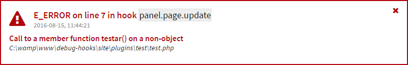
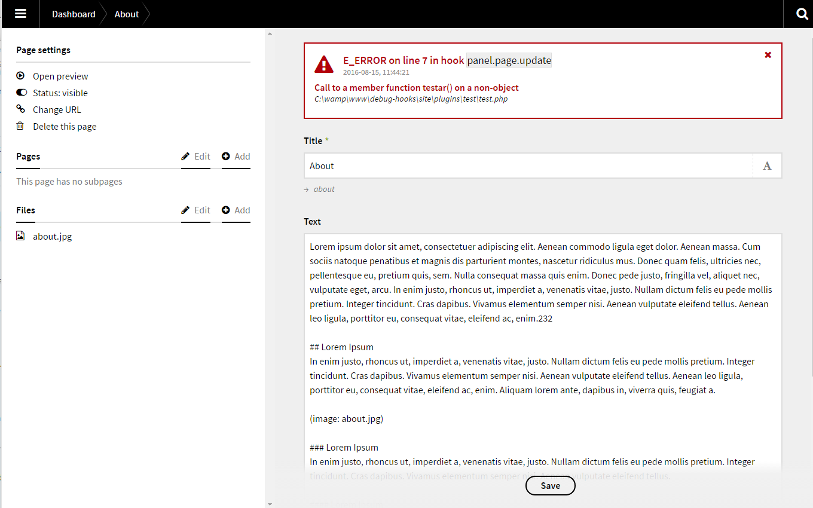

# Kirby Hooks Debugger

There are two main problems with hook errors in the panel.

1. The panel hangs.
1. No useful information about the error is displayed.

This plugin presents a useful error message.





In the future I hope there will be a built in solution, but until then this plugin might be useful. 

## 1. Install

### Kirby CLI

Run this command:

```
kirby plugin:install jenstornell/kirby-hooks-debugger
```

### Manually

```
Add the folder kirby-hooks-debugger into /site/plugins/.
```

## 2. Usage

### 1. Blueprint

It's recommended to add this field before any other field.

```yml
fields:
  hooksdebugger:
    type: hooksdebugger
```

### 2. Debug needs to be `true`

You need to set this in `config.php`:

```
c::set('debug', true);
```

## Options

Add them to config.php.

### Logfile path

Where the log should be stored.

```php
c::get( 'plugin.hooks.debugger.logfile', kirby()->roots()->index() . DS . 'hooks-debugger.txt' );
```

### Error types

Add an array with error numbers or constants.
http://php.net/manual/en/errorfunc.constants.php

Default is to only show fatal run-time errors.

```php
c::get('plugin.hooks.debugger.error.types', array(1));
```

## Changelog

**0.2**

- Does no longer require to be loaded first.
- Removed hook name from error message to make it work out of the box.
- Removed `plugin.hooks.debugger.hooks` option.

**0.1**

- Initial release

## Requirements

Kirby 2.3.2

## License

MIT